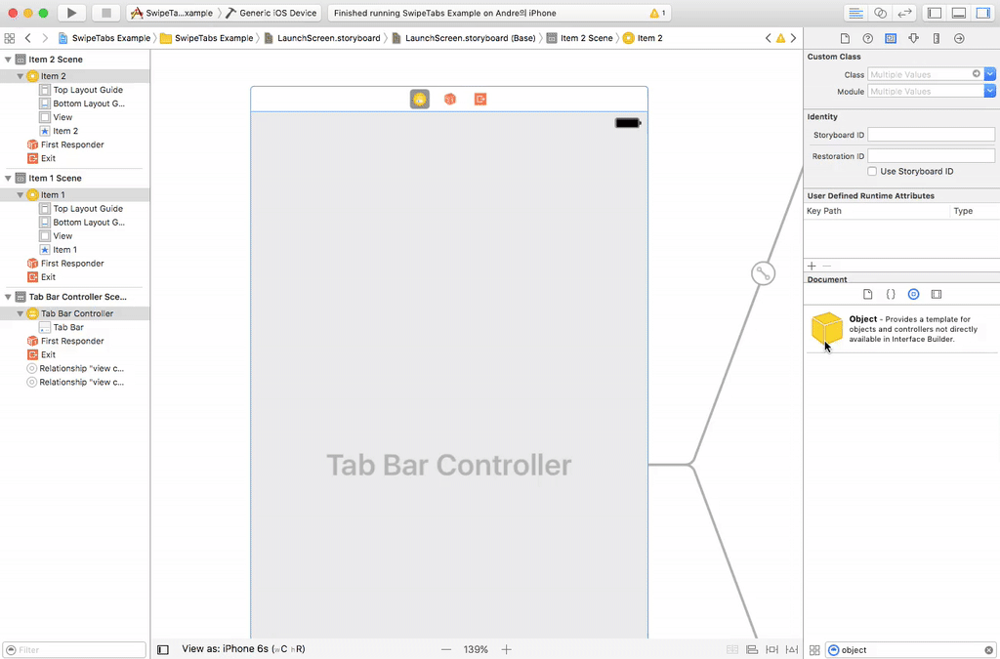

# SwipableTabs
Implements Swipe/Slideable TabBar Interactive Animation and Transition Delegate for UITabBarController

This is based on Apple's [Original Demo](https://developer.apple.com/library/content/samplecode/CustomTransitions/Introduction/Intro.html) ported to Swift 3.0 and simplified a bit.

##Enhancements
This version has 2 main enhancements over the originals:

1. Properly Handles the 'More' Tab Properly (Inlcuding Rotation)
2. Properly Handles Status Bar Coloring Between Swipes

## What does it look like?

##How to Implement?
Its pretty simple: 

1. Import the .framework 
2. Create the SwipeTransitionDelegate and Connect it in Interface Builder
3. There is no Step 3!

##Anything Else?
### Licence
Licence is [MIT](LICENSE)

### Notes
- The part that handles 'More' tab swiping case is a little messy...
- Would like to upload to CocoaPods at some point...
